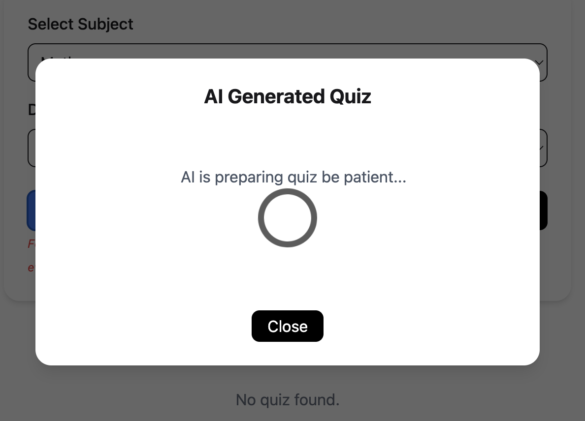
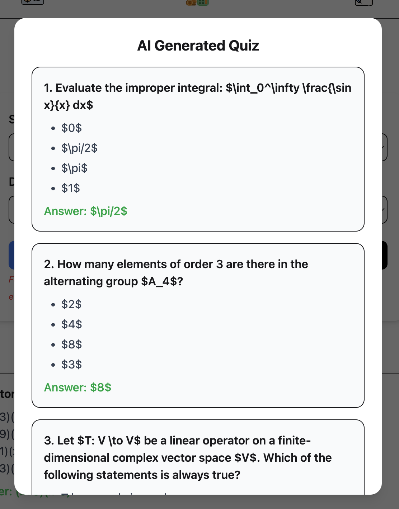
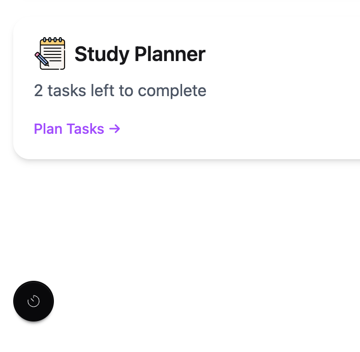
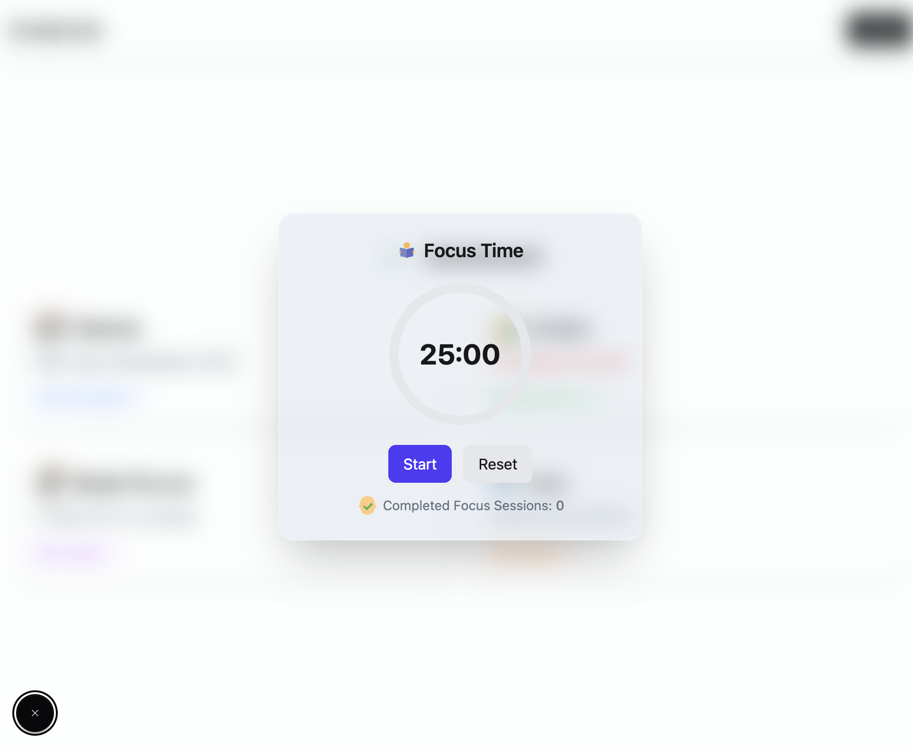

# 🧑‍🎓 StudyEase

**StudyEase** is a full-stack web application designed to make student life easier by managing **class schedules, budgets, study plans, and exam preparation**.  
Built with **React (Frontend)** and **Node.js + Express + MongoDB (Backend)**, deployed on **Firebase (Frontend)** and **Render (Backend)**.

---

## 🌍 Live Links

- 🚀 **Frontend (Live Site):** [https://task-manager-f93cc.web.app](https://task-manager-f93cc.web.app)  
- 📂 **Backend Repository:** [https://github.com/Rupon100/toolkit-backend](https://github.com/Rupon100/toolkit-backend)  

---

## ✨ Features

### 📅 1. Class Schedule Tracker
- Add, edit, or delete classes with **subject, day, time, and instructor**.  
- **Color coding** for subjects for better visualization.  
- Sorted automatically by **day of the week and class time**.  

### 💰 2. Budget Tracker
- Track **income, expenses**.  
- Add categories such as **Food, Transport, Books, Entertainment**.  
- Visual representation using **graphs**.  
- Validates data (**no negative values, valid dates**).  

### 📝 3. Study Planner
- Break down big goals into smaller tasks.  
- Add **subject, task, difficulty, progress, and deadline**.  
- Tracks **progress**: Not Started → In Progress → Completed.  
- Displays time remaining until deadline.  

### 🤖 4. Exam Q&A Generator
- Generate **practice quizzes** using **Google Gemini 2.5 Flash AI API + Static**.  
- Question types: **MCQs**.  
- Choose difficulty level (**Easy, Medium, Hard**).  

---

## 🌟 Unique Features

### 🤖 AI-Powered Quiz Generator (Gemini 2.5 Flash)
- Integrated **Google Gemini AI (2.5 Flash)** for **dynamic quiz generation**.  
- Personalized, intelligent, and much more effective than static questions.  

  
  

  
  

---

## 🛠️ Tech Stack

- **Frontend:** React, TailwindCSS, DaisyUi, TanStack Query, Axios
- **Backend:** Firebase, Node.js, Express.js, MongoDB, CORS  
- **AI Integration:** Google Gemini 2.5 Flash API  
- **Deployment:** Firebase (Frontend), Render (Backend)  

---
